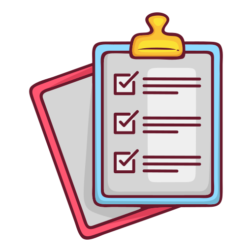
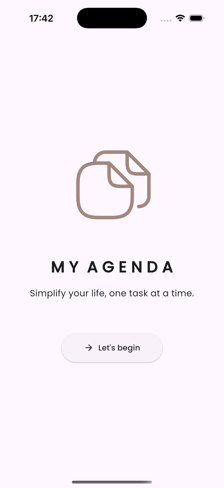
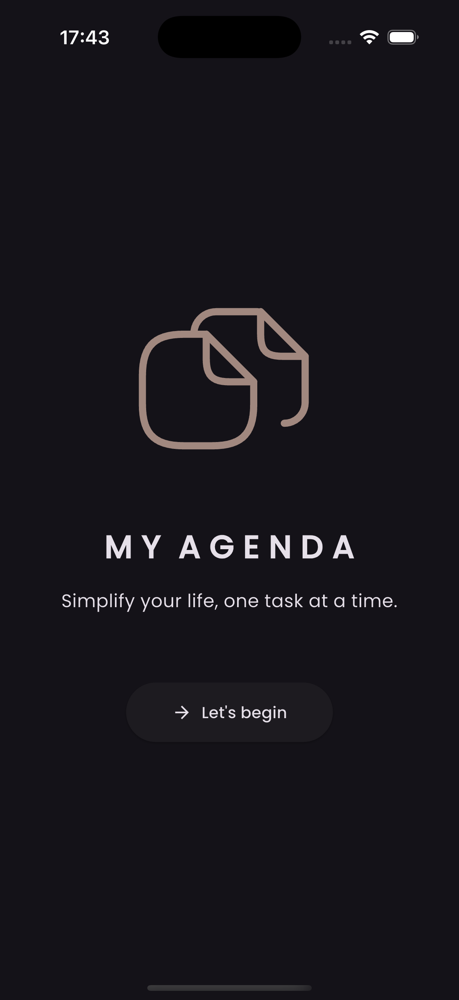
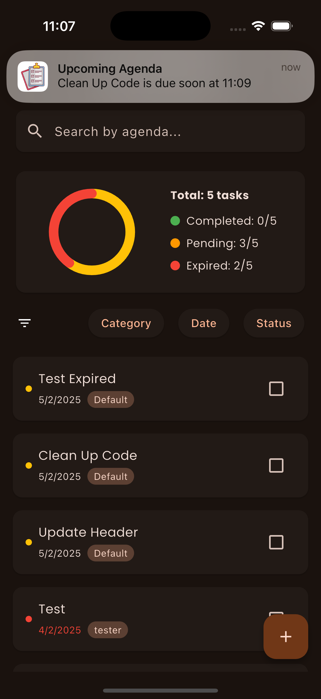

# Agendifynow



A modern, minimalist task management app built with Flutter that helps you stay organized and never miss a deadline.

<!-- ## App Snapshots -->

<!-- | Light Mode | Dark Mode |
|------------|-----------|
|  |  |
| Task Actions | Notifications |
|  |  | -->

## Features

- **Clean, Intuitive Interface**: Simple and elegant design in both light and dark modes
- **Smart Deadlines**: Set and track task deadlines with ease
- **Intelligent Notifications**:
  - Daily reminders for upcoming tasks
  - 15-minutes to deadline reminder notifications
  - Deadline notifications
- **Agenda Management**:
  - Create, edit, and delete agendas
  - Set deadlines with date and time
  - Mark Agendas as completed
  - Automatic status tracking (Pending, Completed, Expired)
  - Multi-select mode for bulk actions (complete/delete multiple agendas)
- **Categories**:
  - Organize agendas by categories
  - Create custom categories
  - Delete categories (except Default)
  - Agendas from deleted categories automatically move to Default
- **Filtering System**:
  - Filter by Category
  - Filter by Date Range
  - Filter by Status (Completed, Pending, Expired)
  - Clear all filters with one click
- **Visual Feedback**:
  - Color-coded status indicators
    - Green: Completed
    - Amber: Pending
    - Red: Expired
  - Animated icons for actions
  - Swipe actions for quick delete/edit
  - Line-through text for completed tasks
- **Smart Features**:
  - Automatic status reset when editing completed tasks with future dates
  - Deadline validation to prevent past dates
  - Local notifications for upcoming deadlines
  - Statistics card showing task distribution
- **UI/UX**:
  - Material Design 3
  - Dark/Light theme support
  - Responsive layout
  - Smooth animations
  - Custom font (Poppins)
  - Intuitive gesture controls

## Getting Started

### Prerequisites
- Flutter (latest version)
- Dart SDK
- IDE: Android Studio / VSCode

### Installation

1. Clone the repository:
   ```bash
   git clone https://github.com/olaeben/myagenda_app.git
   ```
2. Navigate to Project Directory:
    ```bash
    cd myagenda_app
    ```
3. Install dependencies:
    ```bash
    flutter pub get
    ```
4. Run the app:
    ```bash
    flutter run
    ```

### Contributing

Contributions are welcomed! Here's how you can help:

1. Fork the repository
2. Create your feature branch:
    ```bash
    git checkout -b feature/AmazingFeature
    ```
3. Commit your changes:
    ```bash
    git commit -m 'Add some AmazingFeature'
    ```
4. Push your changes to the branch:
     ```bash
    git push origin feature/AmazingFeature
    ```
5. Open a Pull Request

### Development Guidelines
- Follow Flutter's style guide
- Write meaningful commit messages
- Add comments for complex logic
- Update documentation for new features
- Write tests for new functionality

## Tech Stack
- Flutter
- Hive (local storage)
- flutter_local_notifications
- Rive (for animations)


## Acknowledgments
-  <a href="https://www.freepik.com/sticker/check-list_6639748#fromView=search&page=1&position=62&uuid=51c601d9-e20d-4150-9935-2c72220ebab7">Icon by Gohsantosadrive</a>
- Thanks to all contributors and users for their feedback and support.
